  <a href="./README.es.md">
     Español
  </a>
  &nbsp; | &nbsp;
  <a href="./README.en.md">
     English (US)
  </a>

  <h3>💻 Full Stack Developer | 🔮 Desarrolladora en IA | 🛡️ Ciberseguridad | 🛠️ AutoCAD 3D | 🎨 Photoshop</h3>
  
✨ <strong>Bienvenidos a mi espacio en GitHub</strong>

  
Aquí nace la creatividad digital, donde el diseño, el código y la imaginación se entrelazan para dar vida a experiencias únicas.

  
Soy una creadora de mundos interactivos, apasionada por transformar ideas en realidades tecnológicas: desde páginas web funcionales hasta proyectos impulsados por inteligencia artificial y visuales con alma propia.

  
En cada línea de código dejo una parte de mi visión: <strong>orden, estética y propósito.</strong>

  
<em>“Donde otros ven errores, yo veo portales.” ⚡</em>

    

---

  
  

---

  

---

  <h2>🌟 Sobre mí</h2>

Soy una desarrolladora apasionada con experiencia en:

- 🔹 **Desarrollo web Full Stack**: Construcción de aplicaciones web dinámicas y responsivas con tecnologías modernas.
- 🔹 **Inteligencia Artificial**: Diseño de soluciones y flujos para resolver problemas del mundo real.
- 🔹 **Ciberseguridad**: Implementación de buenas prácticas para proteger aplicaciones y sistemas.
- 🔹 **AutoCAD 3D**: Creación de modelos detallados para proyectos de ingeniería.
- 🔹 **Photoshop**: Diseño y edición gráfica profesional.

  
✨ Siempre motivada por la curiosidad, en constante búsqueda de desafíos que impulsen mi crecimiento personal y profesional. Creo en el poder del aprendizaje continuo para transformar ideas en realidades innovadoras. ✨

---

  <h2>🔧 Tecnologías y herramientas</h2>

  
  
  
  
  
  
  
  
  
  
  
  
  
  
  
  
  
  
  
  
  
  
  
  
  
  
  
  
  
  
  
  
  
  
  
  
  
  
  
  
  
  
  
  
  
  
  
  
  
  
  
  

---

## 📈 Estadísticas

---

  <h2>🏆 Proyectos Destacados</h2>

  <h3>🛠️ <a href="https://asclimaplus.com/">ASClimaPlus</a></h3>
  
<strong>DESCRIPCIÓN</strong>: ASClimaPlus es una página web responsiva desarrollada para una empresa de servicios técnicos a domicilio en Madrid. El sitio ofrece servicios de instalación, reparación y mantenimiento de aire acondicionado, fontanería, electricidad, entre otros, y permite a los usuarios consultar información detallada, precios estimados y contactar fácilmente para pedir presupuestos personalizados.

  
<strong>TECNOLOGÍAS</strong>:

  
<strong>FRONTEND</strong>:

  <ul align="left">
    <li><strong>React</strong>: Interfaces interactivas y componentes reutilizables.</li>
    <li><strong>Tailwind CSS</strong>: Diseño moderno y responsivo sin CSS artesanal infinito.</li>
    <li><strong>React Router</strong>: Navegación dinámica.</li>
    <li><strong>Framer Motion</strong>: Animaciones suaves.</li>
  </ul>

  
<strong>INTERNACIONALIZACIÓN</strong>:

  <ul align="left">
    <li><strong>i18next</strong>: Contenido en español e inglés con buena organización.</li>
  </ul>

  
<strong>BACKEND</strong>:

  <ul align="left">
    <li><strong>Node.js + Express</strong>: Formularios de contacto y presupuestos.</li>
    <li><strong>MongoDB</strong>: Almacenamiento de datos.</li>
  </ul>

  
<strong>Otros</strong>:

  <ul align="left">
    <li><strong>Responsive Design</strong>: Móvil, tablet y escritorio.</li>
    <li><strong>Optimización</strong>: Imágenes y rendimiento.</li>
  </ul>

  

  <h3>🤖 <a href="https://mmlstack.com/">MML Stack</a></h3>
  
<strong>DESCRIPCIÓN</strong>: MML Stack es una página web profesional desarrollada para ofrecer servicios de diseño y desarrollo web, posicionamiento SEO, e-commerce y estrategias digitales personalizadas. El sitio está enfocado en ayudar a negocios a potenciar su presencia online con soluciones modernas, visuales y efectivas. Incluye presentación de servicios, planes detallados, testimonios, contacto, WhatsApp directo y política legal completa.

  
<strong>TECNOLOGÍAS</strong>:

  
<strong>FRONTEND</strong>:

  <ul align="left">
    <li><strong>React</strong>: UI dinámica y reutilizable.</li>
    <li><strong>Tailwind CSS</strong>: Diseño limpio y consistente.</li>
    <li><strong>React Router</strong>: Navegación por secciones y páginas.</li>
    <li><strong>Framer Motion</strong>: Experiencia más fluida.</li>
  </ul>

  
<strong>INTERNACIONALIZACIÓN</strong>:

  <ul align="left">
    <li><strong>i18next</strong>: Español e inglés sin duplicar contenido.</li>
  </ul>

  
<strong>BACKEND</strong>:

  <ul align="left">
    <li><strong>Node.js + Express</strong>: Gestión de formularios.</li>
    <li><strong>MongoDB Atlas</strong>: Persistencia y mensajes.</li>
    <li><strong>Nodemailer</strong>: Notificaciones por email.</li>
  </ul>

  
<strong>Otros</strong>:

  <ul align="left">
    <li><strong>Optimización SEO</strong>: Meta, estructura, velocidad.</li>
    <li><strong>Botón flotante WhatsApp</strong>: Contacto directo.</li>
    <li><strong>Panel de administración</strong>: Gestión de leads y formularios.</li>
  </ul>

  

---

  <h2>🌐 Encuéntrame en:</h2>
  <ul>
    <li>💼 <a href="https://www.linkedin.com/in/marian-molina-l%C3%B3pez-705b82240/">LinkedIn</a></li>
    <li>📧 <a href="mailto:marianmolina2907@gmail.com">Email</a></li>
  </ul>

---

  

---

  <h2>✨ Frase inspiradora ✨</h2>
  
<em>"El límite de lo que podemos crear está definido únicamente por nuestra imaginación." 🚀</em>

---

